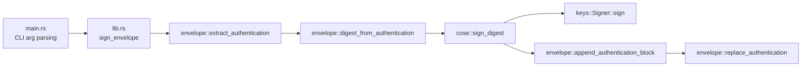

# brody design

`brody` signs an existing `SUIT_Envelope` CBOR file by appending a `COSE_Sign1`
authentication block over its `SUIT_Digest`. It ships as both a library crate and a CLI
binary built on top of it.

## Architecture

| Module | Responsibility |
| --- | --- |
| `main.rs` | CLI-only: argument parsing, key/file loading, calls `brody::sign_envelope` |
| `lib.rs` | Public library surface; `sign_envelope` orchestrates the pipeline below |
| `envelope` | Decodes/patches the top-level `SUIT_Envelope` CBOR map and `SUIT_Authentication` array |
| `cose` | Hand-rolled `COSE_Sign1` construction (`Sig_structure`, protected header, tagging) |
| `keys` | Loads ECDSA signing keys (PEM or raw scalar) and performs the raw signing operation |
| `error` | Single `Error` enum shared by all of the above |

`error`, `envelope`, `cose`, and `keys` are all `pub`, so library consumers can use
`sign_envelope` directly or drop down to individual steps for finer control.

## SUIT_Envelope assumptions

The top-level CBOR item is expected to be a map (optionally wrapped in one CBOR tag),
with:

- key `2` (`suit-authentication-wrapper`): a `bstr .cbor SUIT_Authentication`, i.e. an
  array whose first element is the `SUIT_Digest` bstr, followed by zero or more
  `COSE_Sign1_Tagged`/`COSE_Mac0_Tagged` blocks.
- key `3` (`suit-manifest`): opaque bytes, left untouched by brody.

Signing is **append-only**: brody never removes or replaces an existing signature
block, it only extracts the digest (element `0`) and pushes a new signed block onto the
array. Re-signing/replacing an existing block is not supported.

## COSE_Sign1 construction

`cose::sign_digest` builds, per RFC 9052 §4.2:

1. Protected header `{1: alg}` (alg `-7` for ES256, `-35` for ES384), CBOR-encoded.
2. `Sig_structure` = `["Signature1", protected, h'', digest_bstr]` (external_aad is always
   empty for SUIT signing).
3. Raw `r || s` signature bytes over the `Sig_structure` (not DER — required for COSE
   interop).
4. `COSE_Sign1` array `[protected, {}, digest_bstr, signature]` (empty unprotected header,
   no `kid`), wrapped in CBOR tag `18` (`COSE_Sign1_Tagged`) and bstr-encoded for
   embedding back into the envelope.

ECDSA signing uses RFC 6979 deterministic nonces, so signing the same digest with the
same key always produces byte-identical output — this is relied on by the unit tests.

## Key handling

`keys::Signer` wraps a `p256`/`p384` `ecdsa::SigningKey` for ES256/ES384 respectively.
Keys can be loaded from:

- PEM text (`Signer::from_pem`): tries PKCS8 first, then falls back to SEC1.
- Raw scalar bytes (`Signer::from_raw_bytes`): 32 bytes for P-256, 48 for P-384.

`Signer` has a manual `Debug` impl that always prints `<redacted>` instead of key
material — this must stay manual (never `#[derive(Debug)]` on `Signer`) so accidental
`{:?}` logging can't leak a private key.

## Error model

A single `error::Error` enum (`InvalidEnvelope`, `InvalidKey`, `Io`) is used across the
whole crate, keeping the library's `Result` type uniform for callers.

## Non-goals / deliberate omissions

- **No `coset` crate**: COSE structures are hand-built with `ciborium::value::Value`
  (matches the sibling `taylor` project's stance after a confirmed bug in the `cddl`
  crate; keeps CBOR fully under direct control).
- **No `clap`**: CLI parsing is a small hand-rolled loop over `std::env::args()`; the
  4-flag surface doesn't yet justify the dependency.
- **No `kid` header**: unprotected header is always empty in v1.
- **No re-signing**: existing authentication blocks are never modified or removed.

## Testing strategy

- Unit tests colocated with each module (`envelope`, `cose`, `keys`, `lib`) cover parsing,
  deterministic signing, and CBOR structure of the output, using throwaway
  `openssl`-generated PKCS8 keys.
- `tests/cli.rs` is a black-box integration test that invokes the compiled binary against
  a synthetic envelope and checks the signed output's structure end to end.
- Manual interop validation against real `taylor`-produced envelopes and independent
  Python (`cryptography` + `cbor2`) signature verification is described in
  [README.md](../README.md).
